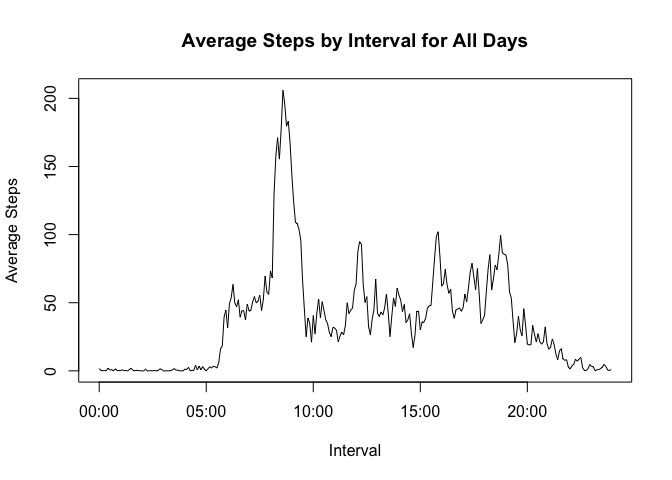
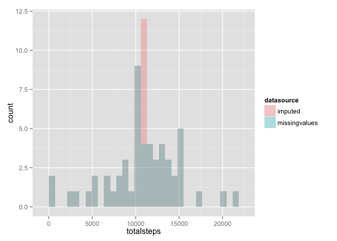

# Reproducible Research: Peer Assessment 1


## Loading and preprocessing the data

The first step is to load the data.  The data file was included in the repository, so this script assumes the zip file is in the working directory.  Unzip if needed, and read the CSV into the system.
    

```r
# Check to see if the file exists
if (!file.exists("activity.csv")) {
    # If not, unzip the file that we know should be there
    unzip("activity.zip")
} 

# Read the CSV file
d <- read.csv("activity.csv")
```

This stores in variable "d" which is a data.frame of 3 variables and 17568 observations.  For the first several exercises, we want to work with a dataset that has removed all rows with NA values.  So we create a new dataset, called "fulldata", with all NA rows removed like so:


```r
# Drop the rows where steps are NA
fulldata<-d[!is.na(d$steps),]
```

## What is mean total number of steps taken per day?

First we calculate the total number of steps taken per day.  This is done by taking an aggregate by date and applying the "sum" function on the steps variable. Finally, in this step we assign more meaningful column names to the totalByDay object: 


```r
# Aggregate by day and apply the sum function to steps
totalByDay <- aggregate(fulldata$steps, by=list(fulldata$date), FUN = sum)
# Assign meaningful column names
names(totalByDay) <- c("date","totalsteps")
```

Next, we create a histogram of the total number of steps taken each day.  (A note on histograms and barplots: The difference between a barplot and a histogram is that a barplot is used for displaying distributions of categorical variables while histograms are used for
numerical variables.  The axis in a histogram is a number line representing the numeric variables, and hence the orders of
the bars cannot be changed on a histogram.  In a bar plot the categories can be listed in any order, though there is often an ordering that makes more sense than others.)

Here is a histogram showing the distribution of total steps per day.


```r
hist(totalByDay$totalsteps,col="cornflowerblue",xlab="Total Steps per Day",breaks=20,main="Histogram of Total Steps per Day")
```

 


Next we calculate and report the mean and median of the total number of steps taken per day.  This is done using the mean() and median() functions on our object "totalByDay".


```r
mean(totalByDay$totalsteps)
```

```
## [1] 10766.19
```

```r
median(totalByDay$totalsteps)
```

```
## [1] 10765
```


## What is the average daily activity pattern?

Next we will make a time series plot (i.e. type = "l") of the 5-minute interval (x-axis) and the average number of steps taken, averaged across all days (y-axis).  

First, we create a new data.frame by aggregating on interval and applying the mean function to the number of steps for each interval.  The second line of code assigns more meaningful column names to the new data.frame.


```r
# Aggregate by interval and apply the mean function to steps
avgByInterval <- aggregate(fulldata$steps, by=list(fulldata$interval), FUN = mean, na.rm = TRUE)
# Assign meaningful column names
names(avgByInterval) <- c("interval","meansteps")
```

If we create a plot based on this new table, gaps will appear in the plot based on the existing intervals.  For example, the first hour is labeled in 5 minute increments, but when it gets to the second hour, it jumps from 55 to 100.  See rows 12 and 13 below:


```r
head(avgByInterval,14)
```

```
##    interval meansteps
## 1         0 1.7169811
## 2         5 0.3396226
## 3        10 0.1320755
## 4        15 0.1509434
## 5        20 0.0754717
## 6        25 2.0943396
## 7        30 0.5283019
## 8        35 0.8679245
## 9        40 0.0000000
## 10       45 1.4716981
## 11       50 0.3018868
## 12       55 0.1320755
## 13      100 0.3207547
## 14      105 0.6792453
```

So, to fix this we convert the given intervals to actual units of time.  This will give us a plot that's distributed evenly throughout the 24 hour period. This conversion is accomplished by dividing each interval by 100, printing the result to 2 decimal places, and then using strptime to read in the printed value based on its format:


```r
avgByInterval$time <- strptime(sprintf("%02.2f", avgByInterval$interval / 100), format="%H.%M")
```

Here is the resulting plot: 


```r
plot(avgByInterval$time,avgByInterval$meansteps,type="l",main="Average Steps by Interval for All Days",xlab="Interval",ylab="Average Steps")
```

 


Which 5-minute interval, on average across all the days in the dataset, contains the maximum number of steps? To answer this, we subset our data.frame based on the max value for average interval:


```r
subset(avgByInterval,subset=avgByInterval$meansteps==max(avgByInterval$meansteps))
```

```
##     interval meansteps                time
## 104      835  206.1698 2015-03-12 08:35:00
```

So the maximum average steps occured at interval 835 (or, in other words, at 8:35am).

## Imputing missing values

Note that there are a number of days/intervals where there are missing values (coded as NA). The presence of missing days may introduce bias into some calculations or summaries of the data.

So next, we calculate and report the total number of missing values in the dataset (i.e. the total number of rows with NAs).  To do this, we take the sum of the result of applying "is.na" to the data.frame. From that, we now know there are 2304 observations with missing values:


```r
sum(is.na(d))
```

```
## [1] 2304
```

Next, we must devise a strategy for filling in all of the missing values in the dataset. According to the assignment, the strategy does not need to be sophisticated. For example, we can use the mean/median for that day, or the mean for that 5-minute interval, etc.

I decided to use the mean for that interval.  One reason I decided to go with this route is because some days are actually completely missing values, and so not every day would have a mean to use.

I create a new dataset that is equal to the original dataset but with the missing data filled in with the mean for that day. This is done in several steps.  First, create a new data.frame which is a subset of the original and represents only the NA observations.

```r
# Create new data.frame containing only values were steps were NA
nas <- d[is.na(d),]
```

Next, merge this data.frame with the existing avgByInterval on the column "interval".  This will attach the averages for each interval. 


```r
# This merge attaches average by interval to the observations where steps were NA
merged<-merge(nas,avgByInterval)
```

Finally, we will create a new data.frame by doing an rbind on the "fulldata" data.frame (which represents the original, minus NA values) with the "merged"" data.frame (which represents the NA values that now have average steps attached for each interval).  We'll call this new data.frame "d2".


```r
# First we drop the column with NA and reorder to match the original data.frame structure
merged<-merged[,c("interval","meansteps","date")]
# Rename "meansteps" to "steps" so we can rbind
names(merged)[2] <- "steps"
# Create a data.frame where the data in "merged" is now stored in the right format so that we can do an rbind
d2 <- rbind(fulldata,merged)
```


With this new data.frame (d2), we will now create a histogram of the total number of steps taken each day and calculate and report the mean and median total number of steps taken per day. Essentially, we are repeating the operations we performed on the original data set.

First aggregate by date and apply a sum on the data:

```r
# Aggregate by day and apply the sum function to steps
totalByDay2 <- aggregate(d2$steps, by=list(d2$date), FUN = sum)
# Assign meaningful column names
names(totalByDay2) <- c("date","totalsteps")
```

Next create the histogram:

```r
hist(totalByDay2$totalsteps,col="cornflowerblue",xlab="Total Steps per Day",breaks=20,main="Histogram of Total Steps per Day (Imputed Data)")
```

 


Next we calculate and report the mean and median of the total number of steps taken per day.


```r
mean(totalByDay2$totalsteps)
```

```
## [1] 10766.19
```

```r
median(totalByDay2$totalsteps)
```

```
## [1] 10766.19
```


Do these values differ from the estimates from the first part of the assignment? What is the impact of imputing missing data on the estimates of the total daily number of steps?  

To answer this first question, let's look at the histograms plotted together, to make differences clear. We will combine the two dataframes into one, so it can be plotted, but first we will add a new column with a factor to distinguish each.


```r
# Add the factor column
totalByDay$datasource <- 'missingvalues'
totalByDay2$datasource <- 'imputed'

# Combine into one data.frame
d3 <- rbind(totalByDay, totalByDay2)

# And plot
library(ggplot2)
ggplot(d3, aes(totalsteps, fill = datasource)) + geom_histogram(alpha = 0.3, position = 'identity')
```

```
## stat_bin: binwidth defaulted to range/30. Use 'binwidth = x' to adjust this.
```

 

Examining the above histogram shows us that all counts are identical (the dark blue color indicates overlapping) except for the red spike above the 10K mark.  This is expected, since we imputed average steps per day for the missing values, so totalsteps around the average appear much more frequently than in the original graph.

The mean and median are also not heavily impacted.  Here is the mean of the original data set (with NAs) and the secondary data set (with imputed values).


```r
mean(totalByDay$totalsteps)
```

```
## [1] 10766.19
```

```r
mean(totalByDay2$totalsteps)
```

```
## [1] 10766.19
```

The values are identical, which is expected, since we imputed values based on the mean for each interval. 


Here's a comparison of the median:


```r
median(totalByDay$totalsteps)
```

```
## [1] 10765
```

```r
median(totalByDay2$totalsteps)
```

```
## [1] 10766.19
```

There is only a slight difference in the median, which is also expected.  Since we imputed values based on the mean for each interval, the center of the distribution is what changed, so the median would remain very close to the original.

## Are there differences in activity patterns between weekdays and weekends?

For this part the weekdays() function was useful in creating a new factor variable to indicate whether the day was a "weekday" or "weekend". We are instructed to use the dataset with the filled-in missing values for this part, which in my project is "d2".  I created this factor variable by adding a column to "d2" called daytype and filling this column with whatever weekday is returned from the value in the date column.  Next I replaced the actual weekday values with "weekday" for Monday through Friday and "weekend" for Saturday and Sunday.  The code:


```r
# Determine the day of the week for the observation based on the date column
# and store this in a new variable "daytype"
d2$daytype<-weekdays(strptime(d2[,2], format="%Y-%m-%d"))
# Replace the weekdays with "weekday" factor
d2$daytype[d2$daytype=="Monday"|d2$daytype=="Tuesday"|d2$daytype=="Wednesday"|d2$daytype=="Thursday"|d2$daytype=="Friday"] <- "weekday"
# Replace the weekends with "weekend" factor
d2$daytype[d2$daytype=="Saturday"|d2$daytype=="Sunday"] <- "weekend"
```

Finally, we are to make a panel plot containing a time series plot (i.e. type = "l") of the 5-minute interval (x-axis) and the average number of steps taken, averaged across all weekday days or weekend days (y-axis). The README file in the GitHub repository contains an example of what this plot should look like using simulated data and was used as a reference for the plot below.

First, we calculate the average steps for each interval by day type and store this in a new data.frame called "avgByIntervalDayType".  Then we load the lattice library and plot average steps for each interval over the factor daytype.

```r
# 
avgByIntervalDayType <- aggregate(d2$steps, by=list(d2$interval,d2$daytype), FUN = mean, na.rm = TRUE)
# Assign more meaningful names
names(avgByIntervalDayType) <- c("interval","daytype","meansteps")
# Load the lattice library
library(lattice) 
# Create the plot
xyplot(meansteps~interval|daytype, data=avgByIntervalDayType, main="Average Steps by Interval for All Days", xlab="Interval", ylab="Average Steps", layout=c(1,2),type="l")
```

 

Note that this plot displays the issue above, where intervals go from 55 to 100 at each hour.  I did not correct for this in this plot, since it appeared in the example plot provided with the assignment.


